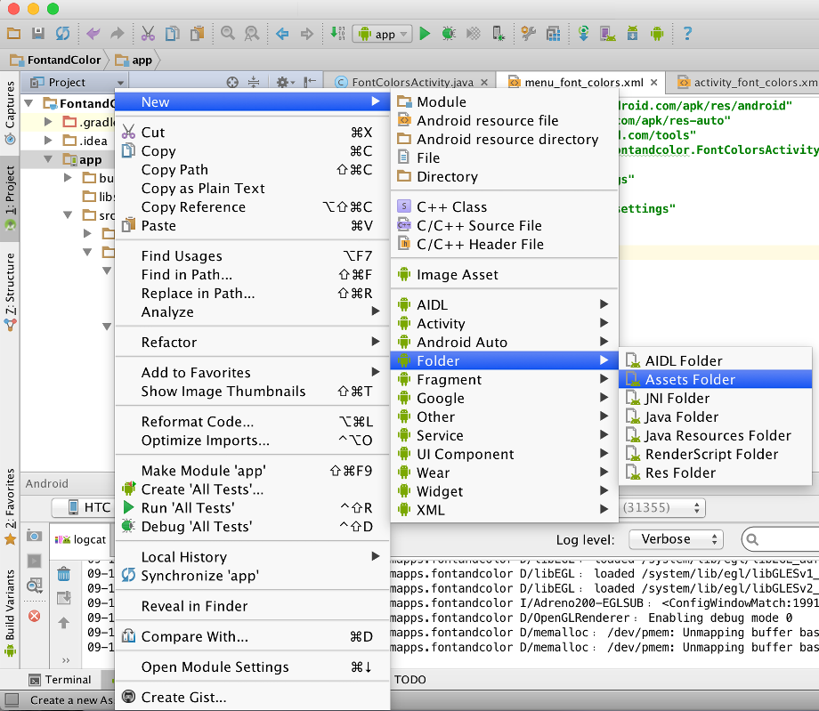

# Color-and-Font

## TextView with Colored Text
There are different ways to change the color of text inside a TextView and I want to share one way of them with you.
In general, we can add styling to strings with HTML markup. I will use the &lt;font> tag to display the word 'Colors' in a TextView. Steps are simple:
1. Store your styled text resource as an HTML-escaped string. Add a new string resource with text 'Colors', surround each character with the &lt;font> tag including color and then replace the angle bracket at start of each &lt;font> tag with &amp;lt;
```
<string name="colored_message"><font color="#0057e7">C</font><font color="#d62d20">o</font><font color="#ffa700">l</font><font color="#0057e7">o</font><font color="#008744">r</font><font color="#d62d20">s</font></string>
```
More information about string-resource formatting and styling can be found at Formatting and Styling.
2. Get the string from the string-table and convert the HTML text into styled text.
```
String text = getResources().getString(R.string.colored_message);
CharSequence styledText = Html.fromHtml(text);
```
3. Change the text of your TextView.
`textView.setText(styledText);`
## App Font
Again, there are different ways to use custom fonts. I will use the Calligraphy library to change the font of my whole app. The library and its documentation can be found at Calligraphy
Here's a sample usage:
1. Add an assets folder to your project if it does not have one.

And then add a sub-folder to the assets and name it fonts.
2. Get your font and copy it to the fonts folder. I will use the free font, Back To School. I renamed the file to BackToSchool.ttf
3. Add the Calligraphy library to the dependencies of your project.
`compile 'uk.co.chrisjenx:calligraphy:2.1.0'`
4. Create an application class and override the onCreate method.
```public class FontColorsApp extends Application {
    @Override
    public void onCreate() {
        super.onCreate();

        CalligraphyConfig.initDefault(new CalligraphyConfig.Builder()
                        .setDefaultFontPath("fonts/BackToSchool.ttf")
                        .setFontAttrId(R.attr.fontPath)
                        .build()
        );
    }
}
```
5. In your manifest, set the name attribute of your 
application> to the new application class.
```&lt;application
    android:name=".FontColorsApp"
    ...
```
6. Override the attachBaseContext() in your activities.
```@Override
protected void attachBaseContext(Context newBase) {
    super.attachBaseContext(CalligraphyContextWrapper.wrap(newBase));
}
```

Run your app and it should display your text using the font from the assets.

Hope it helps and let me hear from you.
